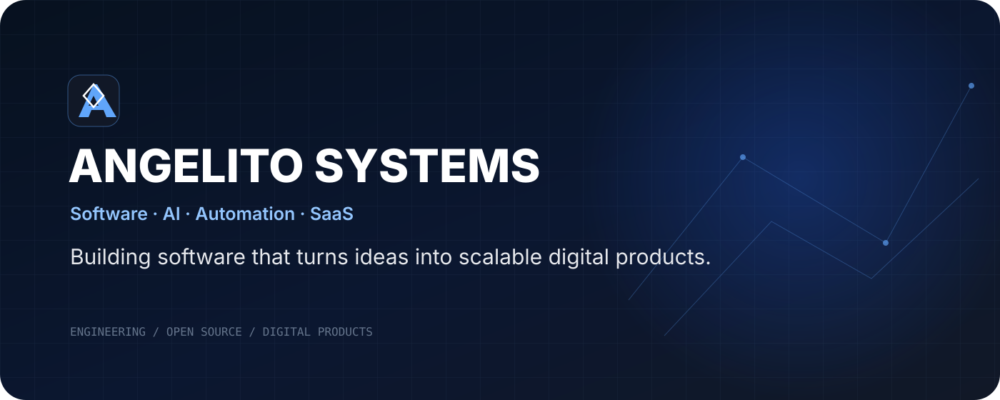
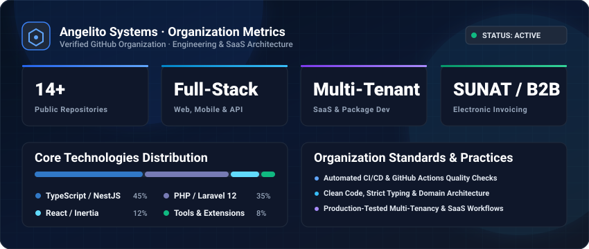
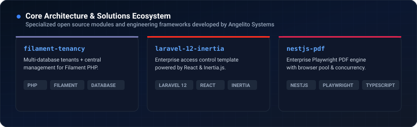
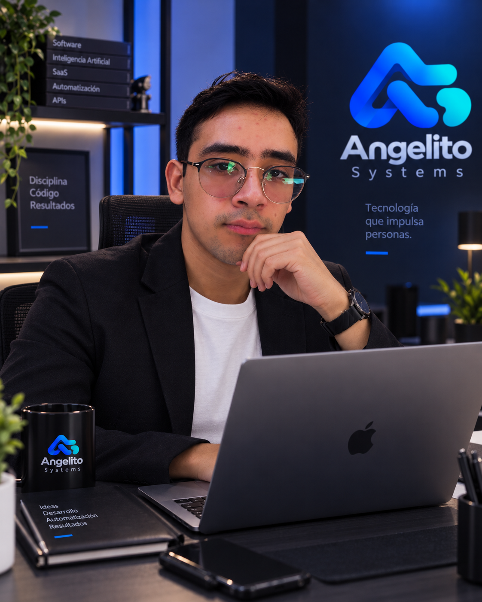
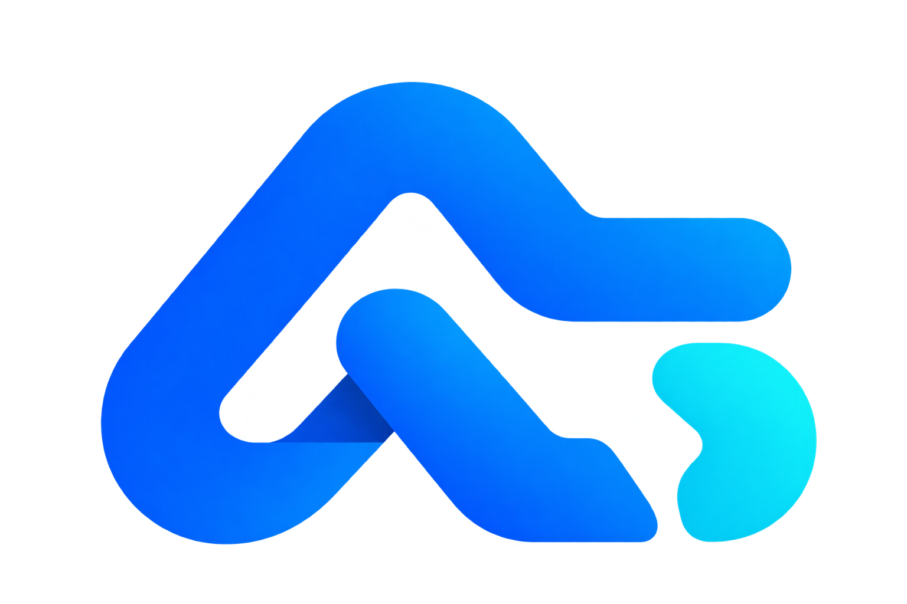

<div align="center">

<a href="https://github.com/angelitosystems">
  
</a>

<br><br>


<br>

[](https://github.com/angelitosystems)
[](https://github.com/angelitosystems?tab=repositories)
[](https://github.com/angelitosystems)
[](https://github.com/angelitosystems)

</div>

---

<div align="center">
  
</div>

## ✦ What We Build

**Angelito Systems** is a software engineering organization specializing in scalable digital products, SaaS architectures, enterprise developer tooling, and automated cloud workflows — from architectural design to high-availability deployment.

> **Turning ideas into robust, scalable, and maintainable digital ecosystems.**

<table>
<tr>
<td width="50%">

### ◇ Enterprise Software & APIs

High-throughput backends, clean API services, and mission-critical business systems built with Laravel 12 and NestJS.

</td>
<td width="50%">

### ◇ Multi-Tenant SaaS Platforms

Cloud architectures designed for multi-tenancy, high concurrency, granular access control, and continuous evolution.

</td>
</tr>
<tr>
<td>

### ◇ Automation & Integrations

Zero-friction business processes, electronic invoicing (SUNAT Perú), and automated data pipelines.

</td>
<td>

### ◇ Modern UI & DevTools

Intuitive, highly responsive web interfaces (React, Inertia.js, Tailwind CSS) and developer productivity packages.

</td>
</tr>
</table>

---

## ⚡ Organization Metrics & Engineering Pulse

<div align="center">



<br><br>



</div>

---

## 🚀 Featured Open Source Repositories

Explore the core public packages and software solutions engineered by Angelito Systems:

<table>
<tr>
<td width="50%" valign="top">

### 🏢 [filament-tenancy](https://github.com/angelitosystems/filament-tenancy)

**Multi-Database Tenancy for Filament PHP**

Comprehensive multi-tenancy package for Filament with isolated database support, central tenancy routing, and dynamic tenant migrations.

`PHP` `Filament` `Laravel` `Multi-Tenancy`

[](https://github.com/angelitosystems/filament-tenancy/stargazers)
[](https://github.com/angelitosystems/filament-tenancy/blob/main/LICENSE)

</td>
<td width="50%" valign="top">

### 🛡️ [Dashboard-Template-Laravel-12](https://github.com/angelitosystems/Dashboard-Template-Laravel-12-Inertia-React)

**Enterprise Admin Template (Laravel 12 + React)**

Production-grade foundation featuring Laravel 12, PHP 8.4, Inertia.js, and React. Built-in RBAC access control and modern UI components.

`Laravel 12` `React` `Inertia.js` `TypeScript`

[](https://github.com/angelitosystems/Dashboard-Template-Laravel-12-Inertia-React/stargazers)
[](https://github.com/angelitosystems/Dashboard-Template-Laravel-12-Inertia-React/network)

</td>
</tr>
<tr>
<td width="50%" valign="top">

### ⚡ [veloxis](https://github.com/angelitosystems/veloxis)

**Ultra-Fast HTTP & GraphQL Client**

Lightweight, modular, and high-performance HTTP and GraphQL client designed for modern Node.js and browser environments.

`TypeScript` `Node.js` `GraphQL` `HTTP`

[](https://github.com/angelitosystems/veloxis)

</td>
<td width="50%" valign="top">

### 📄 [nestjs-pdf](https://github.com/angelitosystems/nestjs-pdf)

**Enterprise PDF Module for NestJS**

Modern, robust PDF generation module powered by Playwright and Handlebars templates for pixel-perfect document rendering.

`NestJS` `TypeScript` `Playwright` `PDF`

[](https://github.com/angelitosystems/nestjs-pdf)

</td>
</tr>
<tr>
<td width="50%" valign="top">

### 🧾 [fact_api](https://github.com/angelitosystems/fact_api)

**SUNAT Electronic Invoicing API (Perú)**

RESTful API built with Laravel 12 and Greenter for SUNAT Perú. Generates and signs UBL 2.1 XML, dispatches invoices/bills, and processes CDR validation.

`Laravel 12` `PHP` `SUNAT` `UBL 2.1`

[](https://github.com/angelitosystems/fact_api)

</td>
<td width="50%" valign="top">

### 🧩 [SDK-VISIONER7](https://github.com/angelitosystems/SDK-VISIONER7)

**NestJS & TypeScript Fiscal SDK**

Enterprise integration SDK for NestJS to query SUNAT fiscal records, issue electronic payment vouchers (CPE), and process dispatch guides.

`TypeScript` `NestJS` `SDK` `Fintech`

[](https://github.com/angelitosystems/SDK-VISIONER7/stargazers)

</td>
</tr>
</table>

<div align="center">

[](https://github.com/angelitosystems?tab=repositories)

</div>

---

## 🧠 Technology Stack

We build reliable software across the entire modern engineering stack:

### Backend & Microservices


### Frontend & Application Interfaces


### Database, Cloud & DevOps


---

## 🛠 Engineering Lifecycle

<div align="center">

```
ARCHITECTURE ──▶ DEVELOPMENT ──▶ AUTOMATED TESTING ──▶ CODE REVIEW ──▶ CI/CD ──▶ DEPLOY ──▶ MONITOR
```

</div>

- **Strict Type Safety & Architecture**: Domain-driven structures and typed contracts across front and backend.
- **Automated Workflows**: Continuous testing, automated linting, and frictionless deployment pipelines.
- **Scalable Multi-Tenancy**: Database-level isolation and secure access control.
- **Enterprise Standards**: Built for performance, security compliance, and long-term maintainability.

---

## 💻 Developer Quickstart

To clone and work with Angelito Systems repositories:

```bash
# Clone any Angelito Systems package or repository
$ git clone https://github.com/angelitosystems/<repository-name>.git
$ cd <repository-name>

# Install dependencies (Node / Bun / Composer)
$ bun install # or composer install
$ bun dev     # or php artisan serve
```

---

## 👤 Leadership

<div align="center">



### Angel Jean Pierre Calderon Mantilla

**Founder · Software Architect · Technology Entrepreneur**

Founder of **Angelito Systems S.A.C.**, focused on designing and building modern, scalable software solutions, enterprise systems, SaaS platforms, APIs, automation tools, and developer technologies.

Leading the company's **software architecture, engineering standards, technical strategy, and product development** across web, backend, cloud, API, and mobile ecosystems.

<br>

[](https://github.com/angelitosystems)

</div>

### 🚀 Areas of Focus

- Software Architecture & System Design
- SaaS & Enterprise Software
- Backend & API Engineering
- Cloud Infrastructure & DevOps
- Artificial Intelligence & Automation
- Web & Mobile Applications
- Developer Tools & SDKs
- Scalable & Distributed Systems

> **Building technology that transforms ideas into scalable digital products.**

---

## ◈ Core Principles

<table>
<tr>
<td align="center"><b>Build for Scale</b><br><sub>Foundations engineered to evolve seamlessly.</sub></td>
<td align="center"><b>Automate What Matters</b><br><sub>Eliminate friction and repetitive tasks.</sub></td>
<td align="center"><b>Clarity Over Complexity</b><br><sub>Readable, maintainable code always wins.</sub></td>
</tr>
<tr>
<td align="center"><b>Continuous Quality</b><br><sub>Testing and CI/CD baked into every release.</sub></td>
<td align="center"><b>Secure by Design</b><br><sub>Zero compromise on data isolation and auth.</sub></td>
<td align="center"><b>User-Centric Impact</b><br><sub>Technology that solves real business challenges.</sub></td>
</tr>
</table>

---

## 🤝 Connect With Angelito Systems

<div align="center">

### Need enterprise software development, SaaS architecture, or custom integrations?

**Let's build scalable digital solutions together.**

<br>

[](https://github.com/angelitosystems)
[](mailto:support@angelitosystems.net)
[](https://github.com/angelitosystems)

<br><br>



### ANGELITO SYSTEMS

**Software · AI · Automation · SaaS**

> **Build. Automate. Evolve.**

© Angelito Systems. All rights reserved.

</div>
