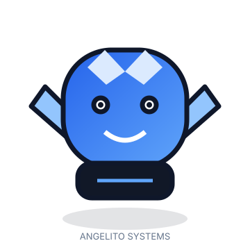
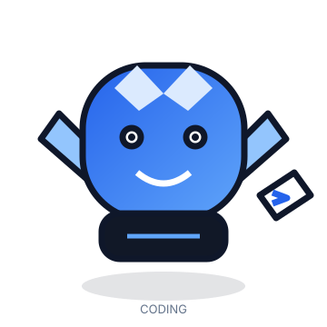
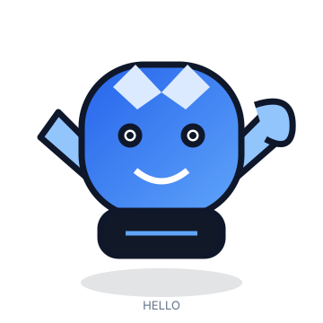
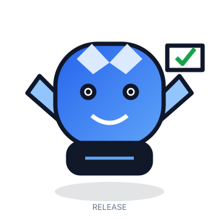

<div align="center">

<a href="https://github.com/angelito-systems">
  
</a>

<br><br>


<br>

[](https://github.com/angelito-systems)
[](https://github.com/angelito-systems)
[](https://github.com/angelito-systems)
[](https://github.com/angelito-systems)

</div>

---

<div align="center">
  
</div>

## ✦ What We Build

**Angelito Systems** creates software products, SaaS platforms, automation systems, APIs, desktop and mobile applications, and AI‑powered solutions — end to end, from architecture to deployment.

Our focus is simple:

> **Turn ideas into useful, scalable and maintainable digital products.**

<table>
<tr>
<td width="50%">

### ◇ Software

Modern systems designed around real business workflows — web, desktop and mobile.

</td>
<td width="50%">

### ◇ SaaS

Cloud products built for scale, reliability and continuous evolution.

</td>
</tr>
<tr>
<td>

### ◇ Automation

Less repetitive work. More intelligent processes.

</td>
<td>

### ◇ AI

Practical AI and machine learning integrated into real products.

</td>
</tr>
</table>

---

## 🚀 Products

<table>
<tr>
<td width="33%" valign="top">

### 🩺 LifeMedSys

**Healthcare SaaS**

Medical management software focused on connected workflows, administration and digital healthcare operations.

`Laravel` `Livewire` `PostgreSQL`

</td>
<td width="33%" valign="top">

### 🦷 Dental System

**Dental Practice Management**

Desktop platform for dental clinic operations — patients, appointments, treatments and billing workflows — plus a companion web dashboard for clinics.

`Java Swing` `React` `NestJS`

</td>
<td width="33%" valign="top">

### 🧰 Developer Tools

**Angelito Systems Packages**

Reusable developer tooling for modern backend and software engineering workflows, including a multi‑tenancy package for Laravel and a NestJS DevTools dashboard.

`NestJS` `TypeScript` `Node.js` `Bun`

</td>
</tr>
</table>

> Repository links are intentionally omitted where a public repository URL has not been verified.

---

## 🧠 Technology

We build across the full stack — web, backend, mobile, desktop and game development.

### Backend


### Frontend & Web


### Mobile, Desktop & Game Dev


### Data & Infrastructure


### AI / Machine Learning


---

## 🛠 How We Build

<div align="center">

**IDEA** → **ARCHITECTURE** → **DEVELOPMENT** → **TESTING** → **REVIEW** → **CI/CD** → **DEPLOY** → **IMPROVE**

</div>

We optimize for:

- clear architecture
- maintainable code
- automated workflows
- secure integrations
- repeatable deployments
- continuous improvement

---

## ✨ Open Source

> **Building tools that help developers build better software.**

Our open-source work focuses on practical packages and reusable engineering components — from a Laravel multi‑tenancy package to Postman‑style NestJS developer tooling.

<div align="center">

[](https://github.com/angelito-systems)

</div>

---

## ⚡ Engineering Activity

<div align="center">


<br>


<br><br>


</div>

> External statistics services are kept optional so the profile remains functional even if a third-party service is unavailable.

---

## 💻 Developer Mode

```bash
$ git clone github.com/angelito-systems/project
$ cd project
$ bun install
$ bun dev

> Angelito Systems
> Building the future...
```

---

## 🤖 Our Mascot

<div align="center">






</div>

A technology-focused character representing **intelligence, software, systems and automation** — designed to be friendly without becoming childish.

---

## 👤 Founder

<div align="center">


### Angel Calderón

**Founder & Full-Stack Software Engineer**

_Building technology with purpose, across web, mobile, desktop and game development._

</div>

---

## ◈ Our Philosophy

<table>
<tr>
<td align="center"><b>Build with purpose.</b><br><sub>Technology should solve something real.</sub></td>
<td align="center"><b>Automate what matters.</b><br><sub>Reduce friction and repetitive work.</sub></td>
<td align="center"><b>Keep it simple.</b><br><sub>Clarity scales better than complexity.</sub></td>
</tr>
<tr>
<td align="center"><b>Design for scale.</b><br><sub>Build foundations that can evolve.</sub></td>
<td align="center"><b>Ship quality software.</b><br><sub>Engineering is a continuous process.</sub></td>
<td align="center"><b>Keep improving.</b><br><sub>Every release is a new starting point.</sub></td>
</tr>
</table>

---

## 🤝 Let's Build Something

<div align="center">

### Have an idea, project or problem to solve?

**Let's turn it into software.**

<br>

[](#)
[](https://github.com/angelito-systems)
[](#)
[](#)

</div>

---

<div align="center">


### ANGELITO SYSTEMS

**Software · AI · Automation · SaaS**

> **Build. Automate. Evolve.**

© Angelito Systems

</div>
